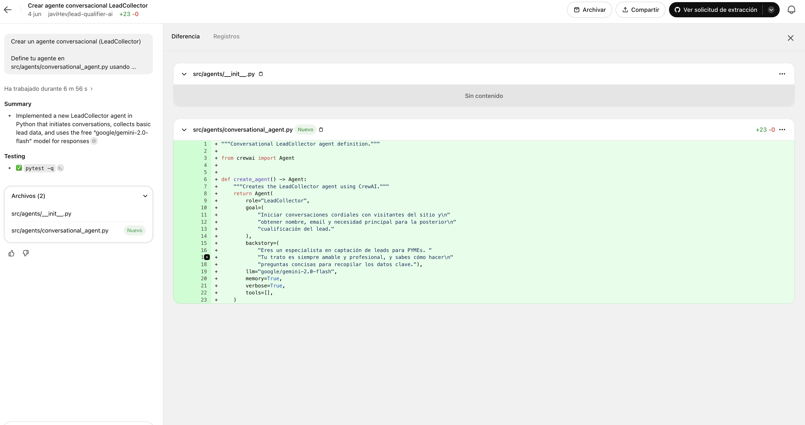
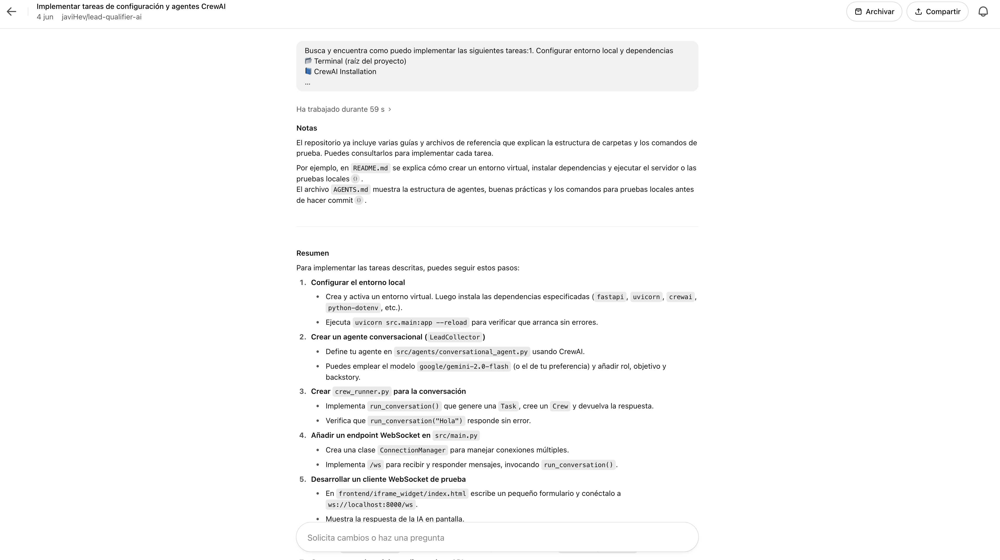
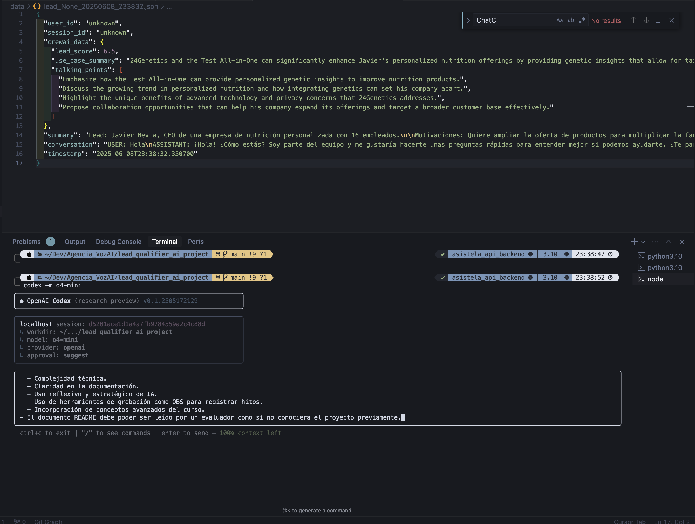
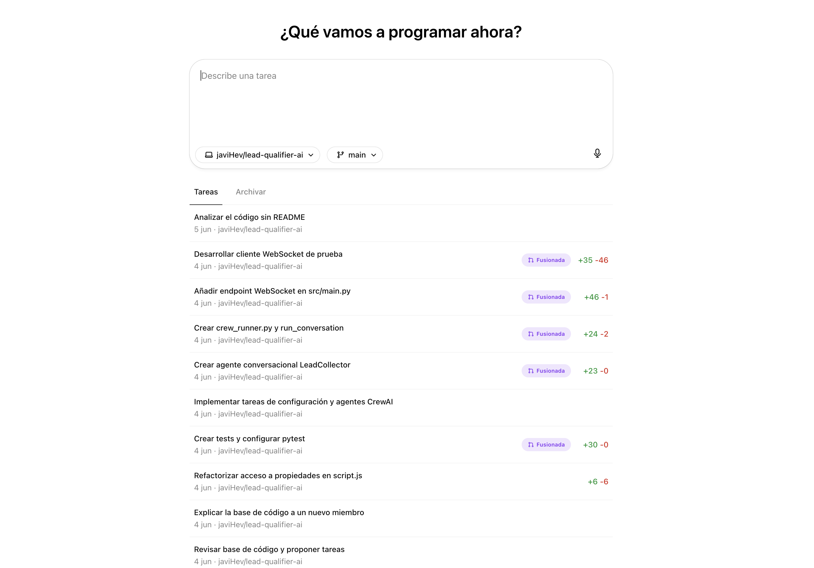

 # Lead Qualifier AI Project

 Desde la conceptualización hasta el despliegue, este proyecto demuestra cómo la Inteligencia Artificial puede integrarse en cada etapa del ciclo de vida del software para crear una herramienta de cualificación de leads única. La aplicación consiste en un backend construido con FastAPI y un widget de chat ligero en HTML/CSS/JavaScript, diseñado para simular un formulario conversacional que recopila información clave de prospectos y genera automáticamente análisis, puntuaciones y resúmenes.

 ## Objetivo Académico
 El propósito de este trabajo es ilustrar cómo distintas herramientas de IA —entre ellas ChatGPT, Claude 3.5 Sonnet, Codex CLI, Cursor y CrewAI— pueden asistir al desarrollador en:
 1. Definir requisitos precisos y completos.
 2. Prototipar rápidamente interfaces y flujos de usuario.
 3. Implementar la lógica de negocio y las integraciones de forma modular.
 4. Verificar y depurar cada componente.
 5. Documentar y preparar la entrega final y el despliegue.

 ## Tecnologías y Herramientas
 El proyecto fue desarrollado sobre Python (3.10–3.13), aprovechando FastAPI para la API REST y Uvicorn como servidor. La capa de datos se modeló con Pydantic, mientras que el frontend utiliza JavaScript puro, Fetch API y Server-Sent Events (SSE) para el streaming de respuestas. En paralelo, se configuró un flujo multiagente con crewAI, apoyado en herramientas RAG (`SerperDevTool`, `ScrapeWebsiteTool`) y la SDK de OpenAI. La configuración se gestiona con YAML y UV (Astral) facilita la gestión del entorno. Para la integración con Airtable se emplea `requests`, y la grabación de hitos se documentó con OBS Studio.

 ## Ciclo de Vida Asistido por IA
 **Toma de Requisitos:** mediante sesiones con ChatGPT y Claude 3.5 Sonnet se perfilaron los campos a recabar (nombre, empresa, necesidad, presupuesto, urgencia, etc.) y se redactó el prompt maestro (`system_prompt`) en `app/config.py`, garantizando un flujo conversacional coherente.

 **Prototipado:** con prompts a Codex CLI y Cursor se bosquejó rápidamente el widget de chat: estructura HTML, estilos CSS y lógica de interacción en `chat.js`. En pocas iteraciones se obtuvo una interfaz funcional que respondía en tiempo real.

 **Implementación:** el backend expone dos endpoints: `/chat/stream` para streaming SSE y `/chat/finish` para cierre de conversación, extracción de datos y scoring. La lógica se organizó en servicios (`OpenAIService`, `CrewaiService`, `AirtableService`), asegurando separación de responsabilidades y facilitando la escalabilidad.

 **Pruebas:** a lo largo del desarrollo se realizaron pruebas manuales completas, identificando y corrigiendo errores con el apoyo de Claude 3.5 Sonnet (ver sección multimedia). Se sentaron las bases para futuros tests automatizados con pytest.

 **Despliegue:** la aplicación puede levantarse localmente con `uvicorn app.main:app --reload` o usando `uv run crewai_plus_lead_scoring`. Está prevista una contenedorización básica con Docker y la documentación generada con Codex CLI guía el despliegue en entornos de producción.

 ## Funcionalidades Clave
 Con esta solución el usuario: 
 - Interactúa con un chatbot que muestra cada fragmento de respuesta en tiempo real.  
 - Finaliza el chat para procesar la conversación completa, extraer datos estructurados del lead y calcular su puntuación.  
 - Recibe un resumen de la conversación y la propuesta de puntos de conversación para seguimiento.  
 - Descarga automáticamente un archivo JSON con toda la información, y opcionalmente crea un registro en Airtable.

 ## Buenas Prácticas y Arquitectura
 El código está organizado en capas: modelos en `app/models.py`, servicios externos en `app/services`, utilidades en `app/utils` y configuración en `app/config.py`. El uso de Pydantic asegura validación estricta de datos y la configuración en YAML facilita ajustes sin modificar código. Se aplican principios SOLID y el patrón de inyección de dependencias para mantener módulos desacoplados.

 ## Multimedia de Demostración
 *Video_Cursor_Claude_Resolviendo_error.mov* muestra la depuración colaborativa con Cursor y Claude 3.5 Sonnet durante la extracción de datos del lead.
 <video src="./media/Video_Cursor_Claude_Resolviendo_error.mov" controls width="600"></video>

 En *codex_creando_agente_para_recoleccion_de_leads.png* se ilustra cómo Codex CLI generó la configuración del `lead_analysis_agent`:
 

 La imagen *codex_recomendandome_como_implementar_tareas.png* captura una sugerencia de Codex para definir las tareas en `CrewaiPlusLeadScoringCrew`:
 

 Con *codexcli_creando_documentacion.png* se ejemplifica la generación automática de documentación técnica:
 

 Finalmente, en *tareas_resueltas_e_implementadas_en_github_por_codex.png* se observa el flujo de commits y pull requests creados por Codex:
 

 ## Conocimientos Avanzados Aplicados
 Se integró RAG (Retrieval-Augmented Generation) mediante `SerperDevTool` y `ScrapeWebsiteTool` para enriquecer el contexto de los agentes. El ejercicio de diseño modular refleja principios de MCP (Modular Cognitive Programming) y demuestra la orquestación de agentes inteligentes con crewAI.

 ## Reflexión y Aprendizajes
 Este proyecto confirmó que la IA no solo acelera la generación de código y documentación, sino que impulsa la calidad de diseño y depuración. La combinación de distintos modelos (GPT-3.5, GPT-4.1-mini, Claude) permitió equilibrar coste y rendimiento. El reto principal fue gestionar correctamente el streaming SSE y garantizar la validez del JSON extraído de la conversación.

 ## Autoría y Contacto
 **Javier Hevia (javihevia)**  
 GitHub: https://github.com/javiHev/lead-qualifier-ai.git
 LinkedIn: https://www.linkedin.com/in/javier-hevia-pedrosa
